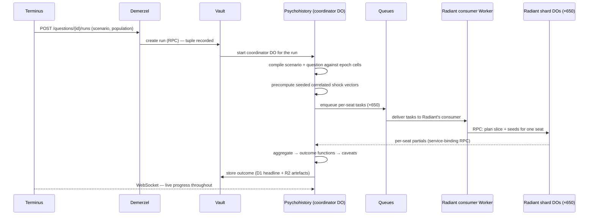

# Architecture

*Six hundred and fifty small rooms, one corridor, and a vault at the end
of it.*

Seldon v3 runs entirely on the Cloudflare Developer Platform as seven
Workers-based services split along domain seams: a console (Terminus), a
gateway (Demerzel), the population (Radiant), datasets (Encyclopedia), the
simulation engine (Psychohistory), the asking domain (Vault), and the
calibration watch (Second Foundation). The load-bearing choice is
Durable-Object-per-constituency sharding: the population lives in ~650
SQLite-backed shards, and simulation compute travels to the data rather than
the other way round. This document owns the topology, the platform mapping,
per-service responsibilities, the three key end-to-end flows, the scale
arithmetic, and the trust boundaries. Deep design of each service lives in
its own document, linked throughout.

## The shape of the system

Three forces shape the architecture:

1. **The population is big; the computation is small.** ~28M households and
   ~50M adults collapse into ~40–80k [cells](02-lexicon.md) for simulation.
   Storage must scale to the population; compute must scale to the cells.
   The design keeps both honest by sharding population state per
   constituency and running the engine's inner loop inside the shard that
   holds the cells (see [D2](14-decisions.md) and [D9](14-decisions.md)).
2. **Only two doors.** Terminus and Demerzel are the only publicly routable
   services, both behind Cloudflare Access. Everything else is reachable
   solely over service bindings (Workers RPC) — no internal service has a
   public URL to defend.
3. **Every store does one job.** Relational metadata in D1, population rows
   in DO SQLite, bulk artefacts and analytics in R2 (with Iceberg / R2 SQL),
   caches in KV. The split rule is a single teachable sentence; the schemas
   live in [10-data-model](10-data-model.md).

The v1 three-service topology (CLI + two HTTP services + Postgres/PostGIS)
and the v2 single-process design are history — see `LEGACY.md` and `v2/` —
and are explicitly discarded, with reasoning recorded in
[14-decisions](14-decisions.md) (D1, D7, D12).

## Topology

```
                      ┌───────────────────────────────┐
      Cloudflare      │        TERMINUS (UI)          │
      Access ────────►│  Worker + static assets       │
                      └──────────────┬────────────────┘
                                     │ typed client (@seldon/client)
                      ┌──────────────▼────────────────┐
                      │        DEMERZEL (gateway)     │
                      │  auth · routing · audit       │
                      └──┬──────────┬──────────┬──────┘
              service    │          │          │   bindings (RPC)
        ┌────────────────▼──┐  ┌────▼─────┐  ┌─▼──────────────┐
        │     RADIANT       │  │  VAULT   │  │ ENCYCLOPEDIA   │
        │ worlds · epochs   │  │ scenarios│  │ sources ·      │
        │ forks · layers    │  │ questions│  │ ingestion ·    │
        │ dossiers · cells  │  │ runs ·   │  │ catalogue      │
        │ ┌───────────────┐ │  │ outcomes │  └─┬──────────────┘
        │ │ seat shards   │ │  └────┬─────┘    │ Workflows
        │ │ (DO × 650)    │ │       │ creates  │ R2 raw/staged
        │ └───────────────┘ │  ┌────▼──────────▼─────┐
        └───────▲───────────┘  │    PSYCHOHISTORY    │
                │ cells        │ run coordinator DO  │
                └──────────────│ fan-out via Queues  │
                               └────────▲────────────┘
                                        │ calibration · drift · cron
                               ┌────────┴────────────┐
                               │  SECOND FOUNDATION  │
                               └─────────────────────┘
```

Reading notes: arrows into Radiant's shards from Psychohistory represent
per-seat simulation tasks — Queues can deliver only to consumer Workers,
never to a Durable Object, so the sim-task consumer lives inside Radiant,
consumes the queue, and invokes the local shard DOs over RPC; shards post
partials back to Psychohistory's coordinator over service-binding RPC.
That seam keeps Radiant's shards bound only inside Radiant (trust
boundary 3 below). Second Foundation drives the other services on cron
(freshness checks, standing-question re-runs, calibration sweeps) through
the same service bindings; Vault records every run and receives every
outcome — nothing is predicted without being archived.

## Services

### Terminus — the console

The entire UI: a Worker serving static assets (React SPA) plus a thin edge
layer. Browse the replica on the map down to street level, click a house for
its dossier, manage datasets, scenarios, questions, runs, and outcomes.
Terminus consumes only `@seldon/client`; it holds no domain state of its
own. Full screen-by-screen design in [09-terminus](09-terminus.md).

### Demerzel — the gateway

The one public API. Validates the Cloudflare Access JWT on every request,
maps identity to role, routes to internal services over service bindings,
enforces rate limits, and writes the audit log (D1). REST + JSON, OpenAPI-
described, Zod-validated at the boundary. Full API design in
[11-api](11-api.md).

### Radiant — the population

Owns worlds, the canon replica, epochs, forks, layers, cells, and the
household dossier. Registry metadata (worlds, epochs, forks, layers) lives
in D1; the population itself lives in per-seat shard DOs — one SQLite-backed
Durable Object per constituency per world, each holding its slice of
households, persons, and cells. A world registry DO coordinates. Synthesis
is a Workflow: derive marginals, fan out per-seat IPF, validate fidelity,
publish the epoch. Full population design in
[04-population](04-population.md).

### Encyclopedia — datasets

Source manifests, ingestion workflows (fetch → verify → stage → load →
derive), the catalogue, provenance, and data versions. Raw and staged
artefacts live in R2; catalogue metadata in D1; staged datasets are
registered as Iceberg tables for R2 SQL. Manual-intervention sources are
first-class, surfaced as a "needs a hand" queue in Terminus. Full dataset
design in [05-datasets](05-datasets.md).

### Psychohistory — the engine

Pure compute; owns no long-lived domain state. One coordinator DO per run:
it compiles scenario + question into a plan against the epoch's cells,
precomputes seeded correlated shock vectors, fans per-seat tasks out over
Queues (Radiant's consumer Worker invokes the shard-local compute),
aggregates partials, applies outcome functions and caveats, and streams
progress to Terminus over WebSocket.
Full engine design in [08-engine](08-engine.md).

### Vault — the asking domain

Scenarios, questions, runs, and outcomes — the archive of every prediction
ever made. Documents and headline results in D1; bulk run artefacts in R2.
Vault records a run before Psychohistory computes it and stores the outcome
after; the reproducibility tuple is its address. Scenario and question
models in [06-scenarios](06-scenarios.md) and [07-questions](07-questions.md).

### Second Foundation — calibration and watch

Backtests, calibration (the shock magnitudes the engine consumes), drift
monitoring, source-freshness watch, and scheduled work: polling refresh,
standing-question re-runs (daily 06:00 UTC plus on every polling refresh —
the cadence is stated in [07-questions](07-questions.md)), and replica
refreshes when population-relevant data changes. It quietly corrects the
model and never adjusts silently — its outputs are versioned,
provenance-stamped configuration.

**Synthesis trigger policy.** Second Foundation owns the decision to mint
an epoch. A new `populationDataVersion` — the hash over only the
population-input sources enumerated in the world's synthesis config (see
[05-datasets](05-datasets.md)) — proposes a synthesis run. Routine
marginal refreshes auto-run; boundary, geography, or synthesis-config
changes require owner approval in Terminus; and the minimum interval is
one epoch per week unless an owner forces one manually.

**Drift metrics.** Four watched quantities, each with a threshold and a
route:

1. **Standing headline vs `polling_now`** — any option's mean share
   diverging from the poll-of-polls by more than 3 points across two
   consecutive standing runs.
2. **Epoch demographics vs the latest ONS mid-year estimates** — national
   age×sex totals off by more than 1%, or any seat marginal beyond the
   synthesis fidelity tolerance.
3. **Backtest score regression** — Brier or log score worse than the
   recorded baseline for the same backtest by more than 5%.
4. **Source staleness** — any source overdue by more than one full period
   of its declared cadence.

A tripped threshold raises an alert on Terminus's drift watch, tagged
with the metric and the offending artefact; (1) and (3) additionally
badge affected standing outcomes with a drift caveat, and (2) proposes a
synthesis run under the trigger policy above. Nothing auto-corrects:
every alert demands a human, then a versioned configuration change.

**Calibration cadence.** Shock magnitudes are re-fitted on every new
election pair and on any boundary change. Honestly: exactly one pair
exists today (2019 notional results → 2024 actuals, both on 2024
boundaries), so fitted intervals are correspondingly humble and say so in
their provenance.

**Shy-response estimation.** Per-party shy factors are estimated from
final-poll-vs-result deltas in the historical polling archive
([05-datasets](05-datasets.md)), shrunk toward zero. The factors ship as
committed, provenance-stamped configuration consumed by question caveats
([07-questions](07-questions.md)) — never hand-set.

Execution mechanics of backtests live with the engine in
[08-engine](08-engine.md); policy and cadence are Second Foundation's own.

## Platform mapping

| Cloudflare primitive | Use in Seldon |
| --- | --- |
| **Workers** | Every service. Service bindings + WorkerEntrypoint RPC between them; no public surface except Demerzel and Terminus. |
| **Durable Objects** (SQLite-backed) | The load-bearing choice. Per-seat **shards** in Radiant (one DO per constituency per world — ~650 for the UK — each holding its slice of households/persons/cells in DO SQLite, comfortably under the 10 GB/object limit at ~43k households/seat). Run **coordinators** in Psychohistory (one DO per run: compiles the plan, fans out, aggregates, streams progress over WebSocket). World registry DO in Radiant. Ingestion-state DOs in Encyclopedia if useful. |
| **D1** | Per-service relational metadata: Encyclopedia's catalogue, Vault's scenarios/questions/runs/outcomes, Radiant's world/epoch/fork/layer registry, Demerzel's audit log. Not for population rows (that's DO SQLite + R2). |
| **R2** | Bulk artefacts: raw fetched source files, staged Parquet, epoch snapshots (Parquet, partitioned by seat), run artefacts, map tiles (PMTiles), exports. Zero egress cost matters for tiles. |
| **R2 Data Catalog + R2 SQL** | Epoch snapshots and staged datasets registered as Apache Iceberg tables; heavy analytical queries (national crosstabs, layer validation) run via R2 SQL instead of hauling Parquet through Workers. There is no Workers-native Iceberg writer: the ingestion and epoch-publish Workflows invoke a small Container step (PyIceberg `add_files`/append) to commit staged and snapshot Parquet into the catalog. Both products are open beta, reached with a Cloudflare API token held as a Worker secret. This replaces v2's DuckDB role. |
| **Queues** | Fan-out/fan-in: synthesis tasks per seat, simulation shard tasks, ingestion events, tile-build jobs. Consumers are always Workers — a queue cannot deliver to a DO — so the sim- and synthesis-task consumers live in Radiant and invoke its shard DOs over RPC. DLQs everywhere. |
| **Workflows** | Durable multi-step orchestration: ingestion (fetch → verify → stage → load → derive), epoch synthesis (derive marginals → per-seat IPF → validate → publish), run execution envelope, calibration sweeps. Retries + resumability for free. |
| **KV** | Read-mostly caches: poll-of-polls, compiled scenario plans, hot aggregates, tile manifests, feature flags. |
| **Cron Triggers** | Second Foundation's watch: polling refresh cadence, source-freshness checks, drift checks, standing-question re-runs. |
| **Containers** | Escape hatch for compute that outgrows Workers CPU limits: full-UK tile builds, very large calibration sweeps, the Data Catalog commit step. Attached via DOs, still deployed from the monorepo. The largest instance is 4 vCPU / 12 GiB memory / 20 GB disk, so the full-UK tile build is a chunked pipeline — per-region tile builds merged into one PMTiles archive, never a single in-memory pass. Default is *not* to need them. |
| **Workers AI / AI Gateway** | Roadmap-tier: natural-language → DSL question drafting; persona interviews grounded in a dossier ("ask this household why"). Always labelled as generative, never part of the statistical path. |
| **Vectorize** | Roadmap-tier: semantic search over the catalogue and question archive. |
| **Analytics Engine** | Operational telemetry: run timings, shard health, ingestion stats. |
| **Cloudflare Access (Zero Trust)** | Auth for Terminus + API: small-team policy now, org-ready later. Demerzel validates the Access JWT on every request. |
| **Workers static assets** | Terminus ships as a Worker with static assets (React SPA + a thin edge layer). Pages is not used (superseded). |
| Not used | Hyperdrive (no Postgres anywhere — deliberate; see [D7](14-decisions.md)). |

## Key flows

### 1. Ingest → epoch

The canon advances only through this flow; nothing edits it in place.

1. An Encyclopedia Workflow fetches a source: checksum verified, `expect`
   guards applied, failure loud. Detail in [05-datasets](05-datasets.md).
2. The source is staged to typed Parquet in R2, loaded and validated
   (row counts, key uniqueness, referential joins), and the catalogue and
   data version advance in D1.
3. Second Foundation notices a new `populationDataVersion` (cron-driven
   freshness watch) and, under its synthesis trigger policy above,
   triggers Radiant's synthesis Workflow.
4. Synthesis: derive constituency marginals → per-seat IPF fan-out (Queues
   deliver one task per seat to a consumer Worker in Radiant, which
   invokes the seat's shard DO over RPC) → per-seat fidelity validation
   against published marginals, within tolerance or loud failure →
   publish. Detail in [04-population](04-population.md).
5. Publishing an epoch means: shard DO SQLite becomes live for the new
   epoch; a Parquet snapshot partitioned by seat lands in R2; the
   Workflow's Container step commits the snapshot to R2 Data Catalog;
   a tile build renders new PMTiles. The canon has advanced; the previous
   epoch remains addressable.

### 2. Ask → run → outcome



A question, a scenario, and a population choice (epoch or fork) are
submitted in Terminus. Vault records the run — the reproducibility tuple
`(worldId, epochOrForkId, scenarioHash, questionVersion, engineVersion,
referenceDate, seed)` — before any compute starts. `referenceDate` is
pinned at launch (defaulting to the launch day) and is the date
Mule-event decay and polling freshness are evaluated against, so the same
tuple gives the same bytes on any later day. The coordinator DO compiles,
fans out, and aggregates; tasks reach each seat through Radiant's
queue-consumer Worker, and shard-local compute means cells never leave
the DO that holds them. Terminus streams live progress (iterations done, seats
resolved, headline convergence) over the coordinator's WebSocket, routed
via Demerzel. Compilation, shock structure, and determinism guarantees are
the engine's: [08-engine](08-engine.md). Outcome functions and caveats:
[07-questions](07-questions.md).

### 3. Click a house

1. The Terminus map (MapLibre GL + PMTiles) renders household dots at
   street zoom. Tiles are R2 objects read by range request, served through
   Terminus's Worker inside the same Access session — no public bucket.
2. A click yields a household id; Terminus calls
   `GET /households/{id}/dossier` through Demerzel.
3. Demerzel routes to Radiant, which addresses the owning shard DO
   directly (household ids are world- and seat-scoped, so the shard is
   derivable from the id — no lookup hop).
4. The shard assembles the dossier: attributes by layer with per-attribute
   provenance, the household's persons, and modelled leanings joined from
   its local copy of the latest standing run's per-cell results (pushed to
   every shard at run completion), falling back to Vault RPC when absent.
5. The dossier panel renders. Dossier content model:
   [04-population](04-population.md); panel UX: [09-terminus](09-terminus.md).

## Scale maths

The arithmetic that makes the design honest, usable in any doc:

| Quantity | Value | Derivation |
| --- | --- | --- |
| Households (UK world) | ~28M | ONS-published household estimates |
| Adults | ~50M | ONS mid-year population estimates |
| Constituencies (shards) | 650 | 2024 boundaries |
| Households per shard | ~43k | 28M ÷ 650 |
| Persons per shard | ~75k | 50M ÷ 650 |
| Shard DO SQLite size | tens of MB | ~120k rows + layer columns; far under the 10 GB/object limit |
| Cells per seat | ~50–200 | seat × demographic signature |
| Cells nationally | ~40–80k | 650 × cells-per-seat |
| Fan-out per run | 650 tasks | one Queue message per seat |
| Per-shard run cost | tens of ms of CPU | 1,000 iterations × ~150 cells × a handful of options ≈ 10⁵–10⁶ softmax evaluations ([08-engine](08-engine.md) envelope) |
| Epoch snapshot | single-digit GB | Parquet in R2, partitioned by seat |

The critical property: a 1,000-iteration run touches **cells, not
households**. Simulation cost is independent of population size once cells
are derived, and the 650-wide fan-out is embarrassingly parallel. Storage
headroom per shard is two orders of magnitude; a denser world (a country
with far more households per district) would re-shard at a lower admin
level rather than strain a shard — see [D2](14-decisions.md).

## Trust boundaries

1. **The edge.** Cloudflare Access fronts both public surfaces (Terminus,
   Demerzel). No request reaches either without an Access-issued identity.
   All other services have no public route at all — the attack surface is
   two Workers, not seven.
2. **Gateway to services.** Demerzel re-validates the Access JWT on every
   API request (never trusting the edge alone), maps identity to a role
   (owner / operator / viewer), and forwards calls over service bindings
   with the resolved identity attached explicitly. Internal services trust
   Demerzel's identity assertion; they never parse tokens themselves.
   Every mutating request lands in the audit log. Detail:
   [11-api](11-api.md).
3. **Service to storage.** Bindings are per-service: Radiant's D1, shards,
   and buckets are bound only to Radiant; no service reads another's
   database. Cross-service data moves through RPC or R2 artefacts with
   declared provenance, never through shared tables.
4. **Inbound data.** Everything Encyclopedia fetches is untrusted until it
   passes checksum pinning and `expect` guards, and nothing enters the
   catalogue except through the staged pipeline. Manual uploads go through
   the same verification. A poisoned or drifted source fails loudly and
   visibly in Terminus — never silently into the replica.
5. **Generative features.** Workers AI features (question drafting, persona
   interviews) are roadmap-tier, always labelled as generative, and are
   architecturally outside the statistical path: nothing they produce can
   enter a run, an outcome, or the canon without explicit human action
   through the ordinary authoring flows.

Related: [01-vision](01-vision.md) · [02-lexicon](02-lexicon.md) ·
[04-population](04-population.md) · [05-datasets](05-datasets.md) ·
[06-scenarios](06-scenarios.md) · [07-questions](07-questions.md) ·
[08-engine](08-engine.md) · [09-terminus](09-terminus.md) ·
[10-data-model](10-data-model.md) · [11-api](11-api.md) ·
[12-deployment](12-deployment.md) · [14-decisions](14-decisions.md)
