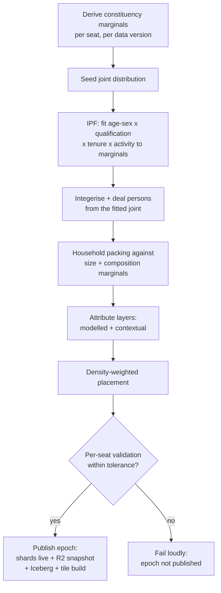

# Population

*Nobody in this population exists; everybody in it is accounted for.*

Radiant owns the living model of society: **worlds** (one per country, the
UK first), the **canon** replica of each world and the immutable **epochs**
it advances through, the **synthesis pipeline** that builds an epoch from
published marginals, the **layers** that enrich it, the **forks and
skews** that bend it into what-ifs, and the **dossier** you see when you
click a house. This document specifies each of those, plus
density-weighted placement, aggregate browsing, and the privacy stance in
full. Dataset ingestion is [Encyclopedia's](05-datasets.md); cell maths
is the [engine's](08-engine.md); the map UI is
[Terminus's](09-terminus.md).

## Worlds

A **world** is one population universe. The UK is the first world, id `uk`.
A world bundles everything population-shaped that varies by country:

- a **geography model** — the admin-level ladder below, plus rollup
  groupings (region, nation, Red Wall…) from `@seldon/geo`;
- a **source catalogue** — which Encyclopedia manifests feed this world;
- a **party registry** (`@seldon/parties`, per-world) and the **electoral
  systems** its election questions may use (FPTP for `uk` v1);
- a **synthesis config** — marginals fitted, category harmonisation
  rules, tolerances.

The world registry lives in Radiant's D1, with a registry DO serialising
changes. Every id in the system is world-scoped (`uk:…`); nothing crosses
worlds implicitly. Adding a country means writing a world config and its
manifests — no engine changes — and the [roadmap](13-roadmap.md) proves
the abstraction in P5 with a small, clearly-labelled fixture world.

### The admin-level abstraction (L1..L4)

Other countries do not have wards and LSOAs, so the geography model speaks
in abstract **admin levels**, and each world maps them to real units:

| Level | Role in Seldon | UK mapping | Approx. count (UK) |
| --- | --- | --- | --- |
| **L1** | Shard + electoral unit. One Radiant DO per L1 per world. | Westminster constituency (2024 boundaries) | 650 |
| **L2** | Mid-level browsing + contextual joins | Electoral ward | ~8,500 |
| **L3** | Placement + contextual joins (deprivation etc.) | LSOA (E&W) / Data Zone (Scotland) / SDZ (NI) | ~42,000 |
| **L4** | Finest placement cell | Output Area | ~230,000 |

L1 is load-bearing: shard key, synthesis fan-out unit, election-counting
unit (`E14001234` in the worked dossier below is an L1 code). Levels
below L1 refine placement and context; groupings above L1 (region,
nation) are rollups, not levels. A world may leave L3/L4 unmapped (NI is
coarse in v1) — placement degrades gracefully to the finest mapped level.

## Canon and epochs

The **canon** is the one living replica of a world, never edited in
place: it advances by **epoch**, each an immutable, addressable version
of the population produced by a synthesis run over a specific population
data version. New census table, fresh boundaries, improved layer — each
lands as a new epoch; the canon is simply the latest published one
(`GET /worlds/uk/epochs/latest` via [Demerzel](11-api.md)).

An epoch is deterministic and content-addressed —
`epochId = hash(worldId, populationDataVersion, synthConfig, seed)` —
same inputs, same epoch, bit for bit: the population leg of the
[reproducibility tuple](01-vision.md). `populationDataVersion` is hashed
over only the population-input sources enumerated in the world's
synthesis config — census marginals, boundaries, population estimates,
address density. Encyclopedia's all-sources `dataVersion` still tracks
lineage, but a polling refresh mints no population data version, so a
poll scrape can never mint an epoch. Lifecycle:
`synthesising → validating → published` (or `failed`, loudly), then
`superseded` when a newer epoch publishes.

A published epoch exists in three forms (storage detail in
[10-data-model.md](10-data-model.md)): live rows in the per-seat shard
DOs, keyed per epoch (`uk:E14001156:ep_5f9c2a1d44e0`) so epochs never
overwrite each other (what simulation and dossiers read); a Parquet
snapshot in R2 partitioned by seat (the archival truth); and an Iceberg
table via R2 Data Catalog (what heavy analytics query through R2 SQL).

Retention is asymmetric on purpose. The R2 Parquet snapshot of **every**
epoch is kept indefinitely — it is the cheap, durable form — while
shard-resident copies and tile builds are disposable and rebuildable
from it. The published epoch's 650 shard objects stay hot; a superseded
epoch's shards hydrate on demand from its snapshot and are evicted when
idle (`cold → hydrating → live → evicted`, re-hydratable — the state
machine lives in Radiant). Superseded epochs therefore stay addressable
forever: old runs stay reproducible, and browsing a superseded epoch's
map works — with a slower first hit while its shards re-hydrate,
disclosed in the UI — without keeping 650 hot shards per epoch.

## The synthesis pipeline

Synthesis is a Radiant-owned [Workflow](03-architecture.md) that turns a
population data version into an epoch. It runs per seat, fanned out over
Queues to a Radiant consumer Worker that invokes each of the 650 shard
DOs over RPC — embarrassingly parallel, deterministic per seat. Fan-in
is explicit: the world-registry DO tracks per-seat completions and
failures, and the Workflow polls it in a step with a timeout, failing
the epoch loudly — unfinished seats listed — if the count never closes
(mirroring the run choreography in [08-engine.md](08-engine.md)).



Stage by stage:

1. **Marginals.** Encyclopedia's derived `constituency_marginals` table
   gives, per seat, the published census distributions: Census 2021 tables
   re-aggregated to 2024 Westminster boundaries for England & Wales;
   Scotland's Census 2022 aggregated up via the published Data Zone →
   constituency lookup; NI at coarser NISRA headline tables. Category
   harmonisation across the three statistical agencies is part of the
   world's synthesis config (manifests: [05-datasets.md](05-datasets.md)).
2. **IPF.** Iterative proportional fitting estimates the joint
   distribution over age×sex × highest qualification × tenure × economic
   activity: start from a seed joint, scale to match each marginal in
   turn, repeat to convergence. IPF matches every marginal exactly at
   convergence; the joint structure between them is estimated, and we say
   so (see the privacy stance below).
3. **Integerisation and person synthesis.** Largest-remainder rounding
   (the v1 algorithm, carried forward because it was correct) turns fitted
   fractional counts into whole persons, preserving marginal totals;
   individuals are then dealt from the integer joint, seeded per seat.
4. **Household packing.** Persons are grouped into households matching the
   seat's household-size *and composition* marginals (couple with
   children, single pensioner, …), so "households where the pensioner
   outnumbers the graduate" is an answerable predicate.
5. **Layers.** Modelled and contextual attributes attach (next section):
   income conditioned on tenure + qualification + region; registration
   probability by age from Electoral Commission research; area joins.
6. **Placement.** Synthetic coordinates, density-weighted (below).
7. **Validation, then publish.** Per seat: every fitted marginal matches
   its census table within the configured tolerance (catching
   non-convergence and harmonisation bugs), household sizes match, adult
   totals match the census adult count, registered totals sit within a
   stated band of the electorate source. Any failing seat blocks the
   epoch — no partially-good canon, no silent publish — and the per-seat
   fidelity report is stored with the epoch, surfaced in Terminus.

### Ageing between censuses

Census marginals go stale between census nights, so stage 1 does not
use them raw: ONS mid-year population estimates re-scale the age×sex
marginals per seat before IPF, keeping the replica's totals and age
shape current between censuses. The re-scaling is a modelled adjustment
and is disclosed as one — provenance on the affected marginals names
the mid-year estimate vintage alongside the census table.

At UK scale: ~28M households / ~50M adults — ~43k households and ~75k
persons per shard — plus the ~50–200 cells per seat the engine computes
on (cells: [08-engine.md](08-engine.md)).

## Placement

Every household gets synthetic coordinates so the map can be browsed to
street level — and the placement is honest by construction:

- Households are placed **within their L4 area** (Output Area; the finest
  mapped level otherwise), weighted by published address-density data at
  that level — OA dwelling and address counts, not individual addresses.
- Placement is seeded and deterministic per epoch: same epoch, same dots.
- Dots land where housing plausibly is — the built-up parts of an OA, not
  the reservoir — but are **never a real address**, never snapped to an
  address register, and the dossier says so (`"synthetic": true`).

The compromise stated plainly: street-level browsing with real spatial
texture, zero claim that any dot is anybody's home.

## Layers

A **layer** is a versioned enrichment attached to the population. Every
attribute belongs to exactly one layer and carries that layer's badge and
provenance chain wherever it is shown.

| Kind | Meaning | Examples (UK) | Badge |
| --- | --- | --- | --- |
| **base** | Drawn during synthesis from census marginals — as close to published truth as a synthetic record gets | age, sex, tenure, qualification, economic activity, household size/composition | `base` |
| **modelled** | Imputed or extrapolated from published statistics; a model, and labelled as one | income (from tenure + qualification + region against ONS earnings tables), energy-rating band (from EPC register distributions), house-price band (from Land Registry price-paid area statistics), registration probability | `modelled` |
| **contextual** | Area-level value joined by geography; true of the area, not measured of the household | IMD deprivation quintile (joined at L3), urban/rural classification, 2024 result context of the seat | `contextual` |

The badge is a fidelity claim: `base` — "this marginal matches the
census"; `modelled` — "this is our estimate, here is the method";
`contextual` — "this describes where they live, not who they are". The
dossier never lets a modelled number dress up as a counted one.

Layers are authored as TypeScript definitions in Radiant:

```ts
export const income = defineLayer({
  id: "income@2",
  kind: "modelled",
  target: "person",
  field: { key: "income", type: "int", unit: "GBP/yr" },
  inputs: ["census2021-tenure", "census2021-qualifications", "ons-earnings"],
  draw: drawIncome, // (person, household, seatFacts, rng) => value
  validation: { holdout: "ons-regional-income", tolerance: 0.05 },
});
```

Two consequences of that shape. First, **every layer field lands in the
DSL's typed field registry** ([06-scenarios.md](06-scenarios.md)):
`income < 30k` is a valid predicate the moment the layer exists, and a
typo'd field is a compile error everywhere. Second, **layers validate
where they can**: a modelled layer declares a holdout — a published
aggregate *not* used as a model input — and synthesis checks the modelled
distribution against it within tolerance, under the same loud-failure
rule as the marginals; where no holdout exists, the provenance says so.
Layers are versioned independently (`income@2`) and an epoch pins the
layer versions it was built with, so a dossier's provenance is stable
forever.

## Forks and skews

A **fork** is a what-if *population* (as distinct from a scenario, which
is a what-if about *behaviour* — the split that earned its keep in v1):

```
fork = (epochId, ordered list of skew ops, seed)
forkId = hash(of exactly that)
```

Skew operations, carried from legacy:

| Op | Effect | Example |
| --- | --- | --- |
| `add-cohort` | Inject synthetic persons matching a template | add 120k newly-18 voters, nationally |
| `remove-cohort` | Remove a fraction of a predicate-matched cohort | remove 10% of `tenure == private-rent && age < 35` in London seats |
| `age-shift` | Advance ages by N years (band membership moves; mortality is *not* modelled, and the fork's lineage says so) | age-shift 5 |
| `scale-band` | Scale an age band's population | scale 18–24 × 1.15 |
| `tenure-shift` | Move a fraction between tenures | 5% private-rent → owned |
| `registration-rate` | Set/scale registration probability for a cohort | `age >= 18 && age <= 24` → 0.90 |

Every op may be scoped by geography (world, region, named seats) and by
DSL predicate. Forks are **materialised lazily per shard**: a fork is
stored as a recipe, and the first time a run touches a seat under it the
shard applies the ops to its slice, re-derives its cells, and caches the
result keyed by `forkId` — a fork probed only in Scotland costs 57 shards
of work, not 650. Forks are first-class selectable populations: any run
targets an epoch *or* a fork, and the fork's full lineage (parent epoch,
ordered ops, seed) prints in the outcome's provenance footer. Forks
answer "what if 18–24 registration hit 90%?"; scenarios answer "what if
they all swung Green?" — and the two compose in one run.

Fork browsing is honest about its granularity. Fork arithmetic is exact
at cell and aggregate level — the counts, breakdowns and leanings a fork
shows are true of the forked cells. At household level the map and
dossiers render the *parent epoch's* households under a fork banner,
with fork-adjusted cell leanings joined on top: household attributes
remain the epoch's, except for the rows an `add-cohort` op materialises.
A removed cohort still dots the street; its weight is gone from the
cells — and the banner says so.

## The dossier

Click a house in Terminus and Radiant's shard returns the **dossier** —
everything the system knows about that household, provenance attached.
Its full shape (JSON, abridged values, real structure):

```jsonc
{
  "householdId": "uk:E14001234:hh:00b3c1",
  "worldId": "uk",
  "population": { "epochId": "ep_5f9c…", "forkId": null },
  "geography": {
    "L1": { "code": "E14001234", "name": "Stroud" },
    "L2": { "code": "E05004357", "name": "Painswick & Upton" },
    "L3": { "code": "E01022307" }, "L4": { "code": "E00114233" }
  },
  "placement": { "lon": -2.2043, "lat": 51.7461, "withinArea": "E00114233",
                 "method": "density-weighted",
                 "synthetic": true },        // always true; rendered as a notice
  "household": {
    "size": 2, "composition": "couple-no-children",
    "attributes": [
      { "key": "tenure", "value": "owned", "layer": "base",
        "provenance": { "source": "census2021-tenure",
                        "dataVersion": "dv_3e8b09c47f21", "method": "ipf+packing" } },
      { "key": "energyRating", "value": "D", "layer": "modelled",
        "provenance": { "layerId": "energy-rating@1", "holdout": "passed" } },
      { "key": "imdQuintile", "value": 4, "layer": "contextual",
        "provenance": { "source": "imd2019", "joinedAt": "L3" } }
    ]
  },
  "persons": [
    {
      "personId": "uk:E14001234:p:01a2f0",
      "cellId": "uk:E14001234:cell:113",   // engine linkage — see 08
      "attributes": [
        { "key": "age", "value": 67, "layer": "base", "provenance": { "…": "…" } },
        // sex, qualification, activity: same shape, layer "base"
        { "key": "income", "value": 24800, "layer": "modelled",
          "provenance": { "layerId": "income@2", "holdout": "passed" } },
        { "key": "registered", "value": true, "layer": "modelled",
          "provenance": { "layerId": "registration@1" } }
      ],
      "leanings": {                       // joined from the standing run (Vault)
        "runId": "run_01j9…", "questionId": "general-election-today@4",
        "asOf": "2026-08-24T06:00:00Z",
        "distribution": { "lab": 0.31, "con": 0.22, "reform": 0.24,
                          "ld": 0.11, "green": 0.07, "dont-know": 0.05 },
        "turnout": 0.74,
        "caveats": ["turnout-weighting@2", "dk-reallocation@1"]
      }
    }
  ],
  "touchedBy": [                          // what reached this household, and why
    { "kind": "scenario-rule", "scenario": "current-polling@2026-08-24",
      "rule": "pensioner-squeeze", "when": "age > 65 && tenure == owned",
      "match": "partial",                 // rule cuts inside the cell — see below
      "matched": ["uk:E14001234:p:01a2f0"] },
    { "kind": "mule-event", "scenario": "current-polling@2026-08-24",
      "event": "leadership-contest", "phase": "decaying" }
  ],
  "questionHistory": [                    // runs whose frame matched this cell
    { "questionId": "general-election-today@4", "runId": "run_01j9…",
      "outcomeId": "out_01j9…", "askedAt": "2026-08-24T06:00:00Z" }
  ]
}
```

Reading it: `leanings` are the person's cell probabilities from the
latest standing run — the dossier never invents a leaning. A standing
run persists a per-cell artefact for exactly this join: mean option
distribution, mean turnout, and the matched rule and Mule-event ids per
cell, written as a `cells` table in the run's R2 artefacts and pushed as
a hot copy — one row per cell, keyed by runId — into each shard's SQLite
([08-engine.md](08-engine.md), [10-data-model.md](10-data-model.md)). At
read time the shard joins its local copy; if it is absent — a cold
shard, an evicted epoch — Radiant falls back to a
[Vault](07-questions.md) RPC for the artefact. `touchedBy` is the same
artefact read the other way: a household's entries are the matched rule
and Mule ids of its cell, and a rule that catches only part of the cell
is badged `partial`. `questionHistory` is not stored per household at
all: Vault computes it at read time — the runs, across the world and the
epoch's lineage, whose compiled frame gave this household's cell a
non-zero match fraction. Persons in the same cell share leanings by
construction — the dossier shows the cell id rather than pretending
person-level variation the model does not have.

## Aggregate browsing

Every view above the household — street, ward, seat, region, nation — is
the same operation: an aggregation over the population with the same
typed-DSL filters used everywhere else. One verb, three shapes:

- **count** — `tenure == social-rent && age > 65`, at any level;
- **breakdown** — the same filter split by a field
  (`breakdown by=tenure` over a ward);
- **compare** — two filters or two geographies side by side, and after a
  run, breakdowns gain modelled columns (turnout, party probabilities,
  expected votes) by joining cell results back onto the slice — v2's
  explore experience, kept whole.

Mechanically: seat-and-below aggregates are answered by the seat's shard
DO (the rows live there); region and national views roll up cached
per-seat partials; heavy national crosstabs run as R2 SQL over the
epoch's Iceberg tables ([10-data-model.md](10-data-model.md)).

Live counts — the as-you-type national count in explore, rule cards and
the frame builder — come in two classes with stated budgets, evaluated
on a debounced typing pause. A **signature-aligned** predicate (banded
and enum fields only) is answered from a national cell-aggregate table —
~40–80k rows per epoch, held in D1/KV — exact, target under 300 ms. A
**person-level** predicate (any continuous field: `age > 50`,
`income < 30k`) cannot be pre-aggregated: it runs as a bounded shard
fan-out with progressive partial counts behind a progress affordance, or
as an async R2 SQL count — seconds, and shown as seconds, never dressed
up as instant. Which class each surface uses, and its UX budget, is
stated in [09-terminus.md](09-terminus.md).

Because the population is synthetic there is **no disclosure risk in
small counts** — but there is a fidelity limit, so aggregates beneath
the resolution of the source marginals render a "below source
resolution" warning rather than false precision. The explore UI itself
is [Terminus's](09-terminus.md).

## The privacy stance

This section is the full statement; every other doc links here.

**Everything in the population is synthetic.** Households and persons are
generated to match *published aggregate marginals* — census tables,
electorate totals, published income and energy statistics. That is the
complete list of what goes in. Specifically:

- **No person-level real data, ever.** Seldon never ingests, links to, or
  models from the electoral register at record level, credit files, data
  brokers, leaked datasets, or any other individual-level source. There
  is no matching step in the pipeline for such data to enter.
- **No real individual is modelled or identifiable.** A synthetic
  household resembling yours is a statistical inevitability in a
  population fitted to the marginals you were counted in — it is not you,
  was not derived from you, and holds no fact about you that is not in a
  published table. There is nothing to re-identify: no record originates
  from a person.
- **Placement is plausible, never real.** Coordinates are
  density-weighted within small areas; no address register is consulted;
  no dot is a claimed address; the dossier labels placement `synthetic`.
- **The fidelity claim is bounded and honest.** IPF matches the published
  marginals exactly; the joint structure between them is *estimated*.
  The replica is "statistically indistinguishable from the UK at the
  published level of detail" — no more, and we print no less. This is why
  the privacy line and the honesty line are the same line: claiming more
  fidelity would require exactly the person-level data we refuse.
- **In data-protection terms**, the replica processes no personal data:
  its inputs are aggregate official statistics published for reuse, and
  its records correspond to no data subject. Source licences and
  attribution are tracked per manifest in [Encyclopedia](05-datasets.md).

The stance is also load-bearing for the product: because every record is
synthetic, the console can show *everything* about *every* household —
full dossiers, street-level dots, unrounded small-area aggregates — with
no suppression, no k-anonymity machinery, and no ethical debt. The
candour of the UI is purchased by the synthesis.

Related: [architecture](03-architecture.md) ·
[datasets](05-datasets.md) · [scenarios](06-scenarios.md) ·
[questions](07-questions.md) · [engine](08-engine.md) ·
[terminus](09-terminus.md) · [data model](10-data-model.md)
