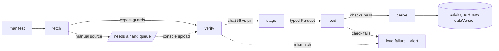

# Datasets

*The Encyclopedia does not collect everything ever published — only what it
can vouch for, and it vouches in writing.*

Encyclopedia is Seldon's dataset service: the registry of every external
source the system consumes, the ingestion workflows that fetch, verify,
stage, load, and derive from those sources, and the catalogue that records
what version of reality every other service is working from. Its design
carries forward the declarative YAML registry from v1 and the pipeline
rigour designed for v2 — checksums, `expect` guards, loud failure — and
re-platforms them on Cloudflare Workflows, R2, and D1. This doc owns the
manifest format, the curated UK source catalogue with its tiers, the
ingestion stages, verification, data versions and lineage, polling, and
freshness. How the loaded data becomes a synthetic population belongs to
[the population design](04-population.md); how the catalogue is browsed
belongs to [Terminus](09-terminus.md).

## Principles carried from legacy

The v1 post-mortem (see [LEGACY.md](../LEGACY.md) and
[v2/04-data-pipeline.md](../v2/04-data-pipeline.md) — history, not code)
gives Encyclopedia four non-negotiables:

1. **No source lands without its loader.** A manifest is only accepted with
   its staging recipe, declared schema, and load checks, proven by a
   golden-fixture test. v1's forty-declared / zero-loadable ratio must be
   structurally impossible.
2. **Failure is loud.** No stage may "succeed" by emitting something
   unusable. Declared schemas and integrity checks make silence impossible.
3. **The pipeline owns the last mile.** The same workflow that stages a
   source also loads it and rebuilds what depends on it. There is no second
   process that "will pick the files up".
4. **Every derived number is traceable** to a source id and a data version.
   Lineage is queryable, not archaeological.

## Source manifests

Manifests are committed YAML under `data/` — the deployable configuration of
Encyclopedia, versioned in git like code. The v3 format keeps the legacy
registry's ids and spirit and adds what v1 lacked: `expect` guards, tiering,
cadence, and a strict separation between *declared configuration* (the
manifest) and *observed state* (checksums, which live in the lock, never in
the manifest).

```yaml
id: ge-results-2024
world: uk
name: 2024 General Election results
group: results
tier: 1
publisher: UK Parliament
licence: OGL-3.0
homepage: https://electionresults.parliament.uk/general-elections/6
cadence: static           # static | event | annual | quarterly | monthly | weekly | daily
fetch:
  url: https://electionresults.parliament.uk/general-elections/6/candidacies.csv
  expect:                 # checked at fetch time — a bot-wall HTML page
    contentType: text/csv #   saved as data.csv fails here, not three
    minBytes: 500_000     #   stages later
stage:
  recipe: recipes/ge-results-2024.ts    # typed TypeScript transform
  outputs:
    candidacies:
      schema:             # enforced on the staged Parquet
        seat:      { type: string, pattern: "^[ENSW]\\d{8}$" }
        party:     { type: string }
        candidate: { type: string }
        votes:     { type: int64, min: 0 }
        share:     { type: float64, min: 0, max: 1 }
load:
  checks:
    - rowCountBetween: [4000, 6000]
    - uniqueKey: [seat, candidate]
    - joinsTo: { column: seat, table: constituency_spine, coverage: 1.0 }
derives: [baseline_shares, seat_facts]
```

Two flags mark the awkward squad. `fragile: true` declares a source whose
fetch is expected to break (scrapes, bot-walled hosts); its failures alert
rather than page. `manual: true` declares a source with no stable URL at
all: the console shows it in a **"needs a hand" queue** with instructions,
and a hand-downloaded file uploaded through Terminus enters the pipeline at
the verify stage, identically to a fetched artefact — the v2 `recover`
concept, now a console flow.

Staging recipes are TypeScript modules (there is no DuckDB in v3 — see
[decision D4](14-decisions.md)); the common cases (CSV select/rename/cast,
spreadsheet sheet extraction, zip members) are one-liners over shared recipe
helpers, and the genuinely weird sources (paginated API walkers, multi-sheet
workbooks) are ordinary code with ordinary tests.

## The UK source catalogue

The legacy registry declares 40 sources; many fed features that no longer
exist. v3 curates from the model's needs backwards. Ids below evolve the
legacy ids where the source is carried.

### Tier 1 — the spine and the baseline

The minimum for a real forecast: real seats, real results, real polling.

| Id | Publisher (licence) | What it is | Cadence |
| --- | --- | --- | --- |
| `constituency-spine` | mySociety (CC-BY-4.0) | The 650 Westminster seats of the 2023 review: GSS code, name, nation, region, electorate, seat type. Everything else joins to this. | event |
| `constituency-boundaries` | ONS Open Geography (OGL-3.0) | 2024 constituency boundaries (generalised), input to the map tile build. | event |
| `ge-results-2024` | UK Parliament results service (OGL-3.0) | Candidacy-level 2024 results, keyed on 2024 GSS codes. The baseline shares. | static |
| `ge-2019-notional` | Rallings & Thrasher via UK Parliament (OGL-3.0) | 2019 notional results recomputed onto 2024 boundaries. The backtest prior. | static |
| `electoral-register` | ONS electoral statistics (OGL-3.0) | Registered parliamentary electorate per constituency. | annual |
| `polling-westminster` | Wikipedia polling tables, `fragile` (CC-BY-SA) | Westminster voting-intention series; scrape with manual fallback (see [Polling](#polling)). | daily check |
| `polling-devolved` | Wikipedia polling tables, `fragile` (CC-BY-SA) | Scotland and Wales series for devolved-nation weighting. | daily check |

### Tier 2 — census, deprivation, enrichment

Feeds synthesis marginals and the DSL's demographic vocabulary.

| Id | Publisher (licence) | What it is | Cadence |
| --- | --- | --- | --- |
| `census-2021-ew` | ONS via Nomis (OGL-3.0) | Census 2021 TS tables **on 2024 Westminster constituencies** for England & Wales: age (TS007A), sex (TS008), household composition (TS003), household size (TS017), tenure (TS054), economic activity (TS066), qualifications (TS067), ethnicity (TS021). One manifest, one table per output. | decennial |
| `census-2022-scotland` | NRS (OGL-3.0) | Scotland's Census 2022 equivalents at datazone level. | decennial |
| `datazone-constituency-lookup` | NRS / ONS (OGL-3.0) | Datazone → 2024 constituency bridge for Scotland's 57 seats. | event |
| `census-2021-ni` | NISRA (OGL-3.0) | Headline demographics for NI's 18 seats — coarse marginals. | decennial |
| `imd-england` | MHCLG (OGL-3.0) | English Indices of Deprivation, LSOA scores/ranks/deciles. | ~5-yearly |
| `wimd-wales` / `simd-scotland` / `nimdm-ni` | WG / SG / NISRA (OGL-3.0) | Devolved deprivation indices — different methodologies, never cross-compared, each mapped to a within-nation quintile. | ~5-yearly |
| `small-area-income` | ONS (OGL-3.0) | Modelled household income per MSOA — anchor for the modelled income layer. | annual |
| `house-prices` | HM Land Registry (OGL-3.0) | Price-paid / median price by small area — the house-price-band layer. | monthly |
| `population-estimates` | ONS mid-year estimates (OGL-3.0) | Ages the replica between censuses. | annual |
| `address-density` | ONS (OGL-3.0) | OA/LSOA household counts + boundaries — density weights for synthetic household placement (see [placement](04-population.md)). | decennial |

The big structural change from v1: ONS publishes census 2021 re-aggregated
to the 2024 Westminster boundaries, which deletes v1's entire
OA → ward → constituency lookup chain for England & Wales. Scotland still
needs its datazone bridge; NI stays coarse.

### Tier 3 — opportunistic

Ingested when a feature wants them; never blocking.

By-election results and local election results (drift signals between
generals) · council composition · Democracy Club candidate lists ("who is
actually standing", election time only) · published MRP estimates
(calibration cross-checks for Second Foundation) · long-run historical
election statistics (backtest context) · claimant count (economic pulse).

### Dropped from the legacy registry

| Legacy source(s) | Why dropped |
| --- | --- |
| `party-register`, `party-accounts`, `party-donations`, `campaign-spending` | Fed finance features that don't exist; parties are a committed registry in `@seldon/parties`. |
| `democracy-club-parties`, `regions` | Superseded by `@seldon/parties` and `@seldon/geo` committed reference data. |
| `wards-2024`, `ward-constituency-lookup`, `output-area-ward-lookup`, `output-area-lookup`, `constituency-area-overlaps`, `local-authority-districts` | The E&W lookup chain deleted by census-on-2024-boundaries. Wards return if sub-seat electoral geography earns a feature. |
| `ge-results-2019` (actual, old boundaries) | Superseded by the 2019 notionals for all model purposes. |
| `lsoa-2021-boundaries` | Folded into `address-density`. |

Anything dropped can return by committing a manifest with its loader — the
bar is the loader, not the idea.

## Ingestion: one Workflow, five stages

Each source ingests through a Cloudflare Workflow — durable, resumable,
retried per step. One workflow instance per (source, attempt); completion
events go onto a queue that Second Foundation and Radiant subscribe to.



- **Fetch** — hardened HTTP: retry with backoff (Workflow-native), browser
  user-agent for bot-walled hosts, `expect` content checks (content type,
  minimum size, magic bytes) so wrong content fails at the door. The raw
  artefact lands immutably in R2 under `raw/` with its sha256, byte size,
  and retrieval timestamp recorded.
- **Verify** — the recorded sha256 is compared to the pinned hash in the
  lock (below). First fetch pins; any later mismatch halts the workflow.
  Accepting an upstream change is an explicit, audit-logged console action
  ("re-pin"), never automatic — the v2 `--repin` flag as a button with a
  name attached.
- **Stage** — the TypeScript recipe transforms raw into tidy, typed Parquet
  in R2 under `staged/`, one file per declared output table. The declared
  schema is enforced on write; a column of the wrong type or an unexpected
  header is a staging failure.
- **Load** — staged tables are registered in the R2 Data Catalog as Iceberg
  tables and the manifest's integrity checks run via R2 SQL: row counts in
  range, key uniqueness, referential joins ("every seat code joins to
  `constituency_spine` with coverage 1.0"). Only a fully green check-set
  marks the source version *loaded* in the catalogue (D1).
- **Derive** — versioned derived tables are rebuilt for any derivation whose
  inputs changed: `constituencies`, `baseline_shares`, `seat_facts`,
  `constituency_marginals`, `polling_now`. These are the tables the rest of
  Seldon actually reads; no service reads a raw source. Derivations are
  TypeScript + R2 SQL, versioned, and stamped with their input versions.

Bucket and key conventions, catalogue DDL, and the Iceberg specifics live in
[the data model](10-data-model.md).

## Verification and the lock

The v2 `MANIFEST.lock` concept survives as data, not a file: the catalogue
(D1) holds one lock record per source —

```jsonc
{
  "sourceId": "ge-results-2024",
  "contentHash": "sha256:9f2b…e41c",     // pinned
  "bytes": 1284113,
  "artefact": "raw/uk/ge-results-2024/2026-08-24T0600Z/candidacies.csv",
  "fetchedAt": "2026-08-24T06:00:12Z",
  "pinnedAt": "2026-08-24T06:00:12Z",
  "pinnedBy": "operator@…",               // Access identity; "system" on first fetch
  "supersedes": "sha256:11ac…90de"        // re-pin history, walkable
}
```

— and every lock state change is also snapshotted to R2, so the lock's own
history is reconstructible even against catalogue loss. Checksums exist to
make one promise concrete: *the bytes the pipeline processed are the bytes
someone signed for.*

## Data versions and lineage

A **data version** is a content hash over the ordered set of loaded source
versions for a world: `dataVersion = hash(worldId, {sourceId →
contentHash})`. Any successful ingestion that changes a loaded source
produces a new data version — cheap, frequent, immutable.

Lineage is recorded at every hop: derived table version → input source
versions → raw artefact hashes. Because [epochs](04-population.md) are
synthesised from a named data version, and every
[run](07-questions.md) records its epoch, any number on any outcome traces
back — in one walk — to the exact bytes fetched from a named publisher on a
named date. Terminus renders this as the lineage view in the catalogue
([09](09-terminus.md)); the ingestion queue event carrying the new data
version is what lets Second Foundation decide a population-relevant change
warrants a new epoch.

## Polling

Polling is the one source class that is both load-bearing and unreliable at
the fetch stage, so it gets specific treatment:

- **Scrape, flagged fragile.** A recipe parses the Wikipedia
  "Opinion polling for the next United Kingdom general election" tables
  (and the Scotland/Wales equivalents) into typed rows: pollster, client,
  fieldwork start/end, sample size, nation, share per party. Scrapes break;
  the manifest says so (`fragile: true`) and breakage is surfaced, not
  paged.
- **Manual entry is the source of truth.** A committed `polls.yaml` plus a
  console entry form (Terminus → Encyclopedia) accept hand-entered polls.
  Console-entered rows are versioned artefacts like any other source, so
  lineage holds. Where scrape and manual overlap, manual wins; the scrape
  is a convenience, not an authority.
- **Poll-of-polls.** The `polling_now` derived table is a recency-weighted
  average per nation — exponential decay on fieldwork-end age (half-life a
  committed, provenance-stamped parameter, on the order of two weeks) —
  with **house-effect shrinkage**: per-pollster, per-party offsets
  estimated against the rolling trend and shrunk towards zero in
  proportion to how few polls a house has published. Small sample sizes
  down-weight. Every `polling_now` row carries the ids of the polls that
  produced it.
- **Consumption.** `polling_now` is cached in KV for fast reads, feeds the
  generated `current-polling` scenario preset ([06](06-scenarios.md)), and
  through it the standing election question ([07](07-questions.md)).

## Freshness

Every manifest declares its expected cadence; Second Foundation's cron
compares each source's last successful ingestion against it and assigns a
state: **fresh** → **due** (cadence elapsed) → **stale** (twice the cadence)
→ **broken** (fetch failing). States are surfaced in the catalogue and on
drift alerts — never silently. Staleness on a Tier 1 source annotates the
standing forecast's caveat ledger; a stale decennial census is normal life,
a two-month-old poll-of-polls is a defect. `static` sources (a past
election's results) are exempt but still re-verified against their pins on
a slow schedule, because upstream files do occasionally move or change.

Related: [architecture](03-architecture.md) ·
[population](04-population.md) · [scenarios](06-scenarios.md) ·
[questions](07-questions.md) · [terminus](09-terminus.md) ·
[data model](10-data-model.md) · [decisions](14-decisions.md)
