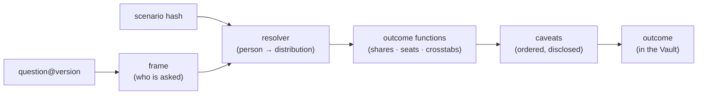

# Questions

*The Vault opens for any question — provided it was written down, framed,
and signed before the answer was known.*

Seldon is a question engine: the replica exists so that survey-style
questions can be asked of fifty million synthetic adults and resolved into
honest, caveated outcomes. A **question** is a first-class, versioned
document owned by Vault — text, an instrument (the answer space), a frame
(who is asked), a resolver (how a person becomes an answer distribution),
outcome functions (how answers become results), and caveats (declared
adjustments, applied in a stated order and disclosed on every outcome).
This doc owns the question model end to end, including the standing
general-election question worked through as the flagship example. What a
*scenario* contains belongs to [scenarios](06-scenarios.md); how a run
actually executes belongs to [the engine](08-engine.md).

## Anatomy of an ask



A run pairs a question with a scenario and a population (epoch or fork);
the question never embeds either. The full identity of any result is the
reproducibility tuple `(worldId, epochOrForkId, scenarioHash,
questionVersion, engineVersion, referenceDate, seed)` — same tuple, same
per-iteration draws; same tuple and iteration count, same outcome
([engine](08-engine.md)). `referenceDate` pins the "today" the run
answers for: Mule-event decay and `current-polling` freshness are
evaluated against it at compile time ([scenarios](06-scenarios.md)).

The document shape, sketched:

```ts
interface Question {
  id: QuestionId;            // world-scoped
  world: WorldId;
  version: number;           // questionVersion in the tuple
  status: "draft" | "published" | "superseded" | "retired";
  text: string;
  instrument: Instrument;    // answer space
  frame: { predicate: string };          // DSL, evaluated per person
  resolver: { name: string; version: number; params: object };
  outcomes: OutcomeFnRef[];  // ordered list of aggregations
  caveats: CaveatRef[];      // declared adjustments (see below)
}
```

## Instruments

An instrument declares the answer space and its type. v1 ships four:

| Type | Answer space | Example |
| --- | --- | --- |
| `single-choice` | exactly one option from a list; `don't know` / `won't say` are **explicit options**, never an implicit residue | vote intent |
| `approval` | yes / no (+ non-substantive options) | "Do you approve of the government's record?" |
| `likert` | an ordered 5- or 7-point scale | "The economy will improve over the next year" |
| `numeric` | a number in a declared range and unit | "How likely are you to vote, 0–10?" |

Options are structured, not strings:

```jsonc
{ "id": "snp", "label": "Scottish National Party", "party": "snp",
  "where": "nation == scotland" }
```

- `party` links an option to `@seldon/parties` (colours, aliases) where
  the option *is* a party.
- `kind: "non-substantive"` marks don't-know/won't-say options so outcome
  functions and caveats can treat them distinctly.
- `where` is an availability predicate in the same DSL as everything
  else: the SNP is only on the ballot in Scotland, Plaid Cymru only in
  Wales. Availability is part of the instrument, so "asked but not
  offered" can never be confused with "refused".

## Frames

The frame is a DSL predicate over persons deciding *who is asked* —
distinct from scenario rules, which decide *how people shift*. Defaults:

- General questions: `age >= 18` (the adult population).
- Election questions: `age >= 18 && registered` (registration is a
  modelled layer; see [population](04-population.md)).

Any registry field may frame a question — `nation == scotland`,
`tenure == private-rent && age < 40` — and the Terminus question builder
shows a live matched-population count while the frame is edited. At
compile time each [cell](02-lexicon.md) gets a **match fraction** — the
exact share of its members satisfying the frame, computed from person
rows in the shard — and the ask weights every cell by it. Enum-axis
fields match a cell wholly or not at all; continuous fields (`age`,
`income`) match fractionally; either way the aggregate is exact, and
weighting cells rather than persons is what keeps population-scale
asking cheap ([engine](08-engine.md)). Honest limit, stated where
relevant: the v1 replica does not model citizenship, so `registered` is
the electoral frame's boundary, and the outcome's provenance says so.

## Resolvers

A resolver is the named, versioned function family that maps a person (in
practice a cell, plus scenario effects) to a probability distribution
over the instrument's options:

```ts
resolve(cell, instrument, compiledScenario, draw): Distribution<OptionId>
```

| Resolver | For | Sketch |
| --- | --- | --- |
| `vote-intent` | single-choice over parties | per-seat baseline shares + scenario effects + cell demographic signature → softmax over log-odds |
| `attitude` | approval / likert / numeric | attribute-anchored latent score per cell → option mapping (ordered cutpoints for likert; scaled value for numeric) |
| `turnout` | probability of voting | logistic model over age, tenure, deprivation, registration |

Resolvers are pinned by `name@version` with typed `params` (e.g. a
softmax temperature), and a question declares which resolver families its
instrument accepts — `fptp-seats` over a likert instrument is a lint
error, not a surprise. The resolution maths, correlated shock draws, and
determinism contract live in [the engine](08-engine.md).

## Outcome functions

Outcome functions aggregate resolved distributions into results. They
form an extensible registry; v1:

| Function | Params | Output |
| --- | --- | --- |
| `national-shares` | — | per-option share, with intervals from the iteration ensemble |
| `fptp-seats` | — | per-seat tallies → seat counts, ranges, majority maths, P(largest party), P(hung parliament) |
| `crosstab` | `by: <registry field>` | option shares broken down by any registry field (`ageBand`, `tenure`, `deprivation`…) |
| `geo-rollup` | `level` — v1: `L1` only | per-seat shares for maps; cells are per-seat, so sub-seat rollups are roadmap |
| `numeric-summary` | — | mean, median, deciles for numeric instruments |

Every function outputs distributions, not points — per-iteration results
are retained in the run artefacts (R2) so Terminus can draw fans and
ranges rather than bare estimates.

## Caveats

A caveat is a declared, versioned adjustment applied between resolution
and the reported outcome. The rule is absolute: **no silent adjustments**.
If the headline is not the raw aggregate, every step in between is named,
parameterised, ordered, and disclosed.

Each caveat type is registered in code with an id, version, params
schema, provenance requirements, and a **rank** that fixes where it sits
in the pipeline. The v1 set:

| Rank | Caveat | Params | What it does |
| --- | --- | --- | --- |
| 10 | `turnout-weighting` | turnout resolver ref | weights each person's answer by their probability of actually voting |
| 20 | `shy-response` | per-party factors, from calibration | corrects stated shares for systematic under-reporting (the shy-Tory class of error); factors come provenance-stamped from Second Foundation's calibration, never hand-set |
| 30 | `dont-know-reallocation` | `mode: exclude \| proportional \| house-model` | resolves the non-substantive mass: drop it, spread it pro-rata, or apply the house model (part abstains, the rest breaks with a status-quo tilt) |
| 40 | `ni-results-based` | results set, optional per-seat overrides | carries seats outside the demographic resolution at their real results — v1's Northern Ireland treatment (see the flagship walk-through) |

The order is part of each caveat's contract, not a convenience: turnout
weighting must precede shy correction because the calibration factors are
estimated against real elections on turnout-weighted stated shares; both
must precede don't-know reallocation because they change the substantive
shares the reallocation distributes over. Ranks are spaced by tens so
future caveats slot in; two caveats claiming one rank is a lint error.

Disclosure is structural. Every outcome carries a **caveat ledger**: each
entry records the caveat `id@version`, its params, its provenance link,
and the headline movement it caused (shares before and after). The raw
pre-caveat aggregate is retained in the run artefacts, so any outcome can
be reproduced with caveats stripped. An outcome with no caveats states
"caveats: none applied" explicitly — silence is never ambiguous.

## Lifecycle and versioning

- **Draft** — mutable, runnable; its outcomes are watermarked
  *provisional* in Terminus.
- **Published** — semantically immutable. Editing instrument, frame,
  resolver, outcome functions, or caveats creates version `n+1` and marks
  version `n` **superseded**. Cosmetic edits (label typos, description)
  do not bump the version but are recorded in Demerzel's audit log.
- **Retired** — accepts no new runs; its outcome history remains in the
  Vault forever. Predictions are never unmade.

Runs pin `questionVersion` exactly. Terminus renders version history as a
diff (instrument options added, caveat params changed) and flags any
comparison of outcomes across question versions — a share movement caused
by a changed don't-know mode must never be read as a movement in opinion.

## The standing election question, end to end

The flagship: *"If a general election were held today, how would you
vote?"* — pinned on the Terminus overview as **the First Crisis**. The
actual question document:

```jsonc
{
  "id": "general-election-today",
  "world": "uk",
  "version": 4,
  "status": "published",
  "text": "If a general election were held today, how would you vote?",
  "instrument": {
    "type": "single-choice",
    "options": [
      { "id": "lab",    "label": "Labour",           "party": "lab" },
      { "id": "con",    "label": "Conservative",     "party": "con" },
      { "id": "reform", "label": "Reform UK",        "party": "reform" },
      { "id": "ld",     "label": "Liberal Democrat", "party": "ld" },
      { "id": "green",  "label": "Green",            "party": "green" },
      { "id": "snp",    "label": "SNP", "party": "snp",
        "where": "nation == scotland" },
      { "id": "pc",     "label": "Plaid Cymru", "party": "pc",
        "where": "nation == wales" },
      { "id": "other",  "label": "Another party" },
      { "id": "dont-know", "label": "Don't know",
        "kind": "non-substantive" },
      { "id": "wont-say", "label": "Prefer not to say",
        "kind": "non-substantive" }
    ]
  },
  "frame": { "predicate": "age >= 18 && registered" },
  "resolver": { "name": "vote-intent", "version": 2,
                "params": { "temperature": 1.0 } },
  "outcomes": [
    { "fn": "national-shares" },
    { "fn": "fptp-seats" },
    { "fn": "crosstab", "params": { "by": "ageBand" } },
    { "fn": "crosstab", "params": { "by": "tenure" } },
    { "fn": "geo-rollup", "params": { "level": "L1" } }
  ],
  "caveats": [
    { "id": "turnout-weighting", "version": 3,
      "params": { "resolver": "turnout@1" } },
    { "id": "shy-response", "version": 2,
      "params": { "source": "calibration/2026-07" } },
    { "id": "dont-know-reallocation", "version": 1,
      "params": { "mode": "house-model" } },
    { "id": "ni-results-based", "version": 1,
      "params": { "results": "ge-2024" } }
  ]
}
```

**Northern Ireland, disclosed.** The instrument offers no NI parties, and
the demographic resolution covers the 632 seats of Great Britain — the v1
replica's Northern Ireland sources are too coarse to support a
demographic forecast worth signing ([population](04-population.md)). NI's
18 seats bypass cell resolution entirely ([engine](08-engine.md)) and
enter the seat tally and the hemicycle carried at their 2024 results —
party ids `dup`, `sf`, `alliance`, `uup`, `sdlp`, linked to
`@seldon/parties` like any other — with per-seat scenario overrides
available. Headline shares are GB shares, as in conventional UK polling.
None of this is silent: the `ni-results-based` caveat names it in every
outcome's ledger.

The walk-through (numbers below are **illustrative fixtures**, not real
polling):

1. **Trigger.** A Second Foundation cron fires daily at 06:00 UTC, and
   again after every `polling_now` refresh — the standing cadence,
   configured as cron triggers in Second Foundation's `wrangler.jsonc`.
   It asks Vault to create a run pairing `general-election-today@4` with
   the newest generated `current-polling` scenario
   ([06](06-scenarios.md)) and the canon's latest epoch.
2. **Record.** Vault writes the run with its full reproducibility tuple —
   `referenceDate` defaulting to the launch day — e.g.
   `(uk, ep_5f9c2a1d44e0, sc_9f2c8b1e07aa, general-election-today@4,
   engine@1.4.0, 2026-08-24, 20260824)`.
3. **Execute.** Psychohistory compiles scenario + question against the
   epoch's cells and runs the correlated-shock ensemble
   ([08](08-engine.md) owns all of this); Terminus streams progress over
   the coordinator's WebSocket.
4. **Aggregate and caveat.** The frame-weighted resolved shares pass
   through the caveat pipeline in rank order:

   | Option | Resolved | +turnout | +shy | Headline |
   | --- | ---: | ---: | ---: | ---: |
   | Reform | 24.0 | 24.8 | 24.2 | 27.6 |
   | Labour | 21.0 | 20.2 | 20.0 | 23.1 |
   | Conservative | 15.0 | 16.1 | 17.0 | 20.0 |
   | Lib Dem | 12.0 | 12.2 | 12.1 | 13.9 |
   | Green | 8.0 | 7.4 | 7.4 | 8.4 |
   | SNP | 2.5 | 2.5 | 2.5 | 2.9 |
   | Plaid Cymru | 0.5 | 0.5 | 0.5 | 0.6 |
   | Other | 3.0 | 2.9 | 2.9 | 3.5 |
   | Don't know | 11.0 | 10.6 | 10.6 | — |
   | Won't say | 3.0 | 2.8 | 2.8 | — |

   Turnout weighting lifts parties with older, likelier-to-vote support;
   shy correction moves Con up and Reform slightly down per the
   calibrated factors; the house-model reallocation resolves the
   non-substantive 13.4% and renormalises. Each column transition is one
   ledger entry. The fourth entry, `ni-results-based`, moves no shares:
   it splices the 18 carried NI seats into the tally.
5. **Store.** The outcome lands in the Vault — D1 headline plus R2
   artefacts (per-seat and per-iteration distributions, the raw
   pre-caveat aggregate). Sketch:

   ```jsonc
   {
     "run": { "tuple": "…", "iterations": 1000 },
     "headline": {
       "shares": { "reform": [27.6, 25.1, 30.2], /* median, 5%, 95% */ },
       "seats":  { "reform": [268, 231, 305], "lab": [172, 148, 199],
                   "sf": [7, 7, 7] /* carried results-based */ },
       "pLargestParty": { "reform": 0.81, "lab": 0.17 },
       "pHungParliament": 0.64
     },
     "caveatLedger": [
       { "caveat": "turnout-weighting@3", "params": { … },
         "provenance": "turnout@1",
         "headlineDelta": { "reform": 0.8, "lab": -0.8, … } },
       { "caveat": "shy-response@2",
         "provenance": "calibration/2026-07", "headlineDelta": { … } },
       { "caveat": "dont-know-reallocation@1",
         "params": { "mode": "house-model" }, "headlineDelta": { … } },
       { "caveat": "ni-results-based@1",
         "params": { "results": "ge-2024" }, "seatsCarried": 18 }
     ],
     "provenance": { "scenario": "current-polling@2026-08-24T06:00Z",
                     "epoch": "ep_5f9c2a1d44e0", "dataVersion": "…" }
   }
   ```

   Per-party seat medians need not sum to 650 — medians of correlated
   marginals don't — and the console says so rather than fudging it.
6. **Reveal.** Terminus pins the First Crisis on the overview: headline
   shares with ranges, the hemicycle, the seat map, crosstabs, the caveat
   ledger, deltas since the previous standing run, and a provenance
   footer naming the polling snapshot, epoch, and calibration the answer
   believed ([terminus](09-terminus.md)).

Every other question — a policy approval, a likert battery framed to
private renters, a numeric cost-of-living scale — is this same machinery
with a different document. Elections are the flagship, not the limit.

Related: [vision](01-vision.md) · [lexicon](02-lexicon.md) ·
[population](04-population.md) · [datasets](05-datasets.md) ·
[scenarios](06-scenarios.md) · [engine](08-engine.md) ·
[terminus](09-terminus.md) · [data model](10-data-model.md)
